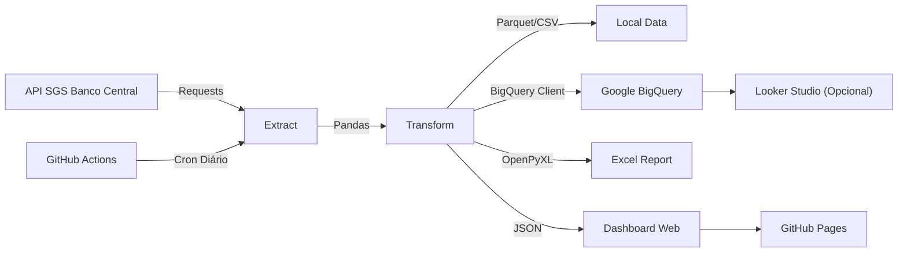

# Pipeline de Dados Econômicos (BCB → BigQuery)

🇧🇷 [Português](#-português) · 🇺🇸 [English](#-english)


**🔗 Dashboard Live:** https://gattz2020.github.io/pipeline-indicadores-br/

---

## 🇧🇷 Português

Este projeto demonstra um pipeline **ETL (Extract, Transform, Load)** completo e automatizado, que extrai dados reais da API pública do Banco Central do Brasil, limpa as informações, agrega por mês e carrega em um Data Warehouse (Google BigQuery) e em arquivos locais (Parquet, Excel).

Tudo é orquestrado de forma gratuita pelo **GitHub Actions**, que roda o script todos os dias úteis.

### 🏗️ Arquitetura



### 🧠 Decisões Técnicas
- **Chunking de datas:** A API do BCB limitou (desde 2025) as requisições a janelas de 10 anos. O módulo de extração fatia o período solicitado em blocos de 5 anos automaticamente.
- **BigQuery Sandbox (Conta gratuita):** O modo sem cartão de crédito do Google Cloud não permite operações DML (`INSERT`/`UPDATE`/`MERGE`), e as tabelas expiram em 60 dias. Por isso, a carga é feita enviando um DataFrame via Job com `WRITE_TRUNCATE`, o que sobrescreve a tabela e renova a expiração. As métricas são recalculadas todo dia.
- **Testes Unitários:** Incluídos no workflow (`pytest`) para garantir a integridade da limpeza e a matemática do cálculo de inflação acumulada e juros reais *ex-post*.
- **CI/CD Misto:** O GitHub Actions não só orquestra a carga em nuvem, mas commita de volta no repositório o arquivo JSON que alimenta o Dashboard estático (GitHub Pages) e o arquivo Excel.

### 🚀 Como testar localmente

1. Clone e crie o ambiente virtual:
   ```bash
   python -m venv .venv
   # Windows
   .venv\Scripts\activate
   # Linux/Mac
   source .venv/bin/activate
   ```
2. Instale as dependências:
   ```bash
   pip install -r requirements.txt
   ```
3. Rode os testes e a extração local:
   ```bash
   pytest tests/
   python -m src.main --target local
   ```
   *Isso criará a pasta `data/` com Parquet/CSV e a pasta `reports/` com o Excel.*

### ☁️ Como configurar o Google BigQuery na sua conta

Se quiser replicar o projeto no seu próprio GCP:
1. Crie um projeto no Google Cloud (anote o ID).
2. Ative a API do **BigQuery**.
3. Crie uma Service Account e adicione as permissões: `BigQuery Data Editor` e `BigQuery Job User`.
4. Gere uma chave JSON para a Service Account.
5. No GitHub do seu repositório, vá em **Settings > Secrets and variables > Actions** e adicione:
   - `GCP_PROJECT_ID`: O ID do seu projeto GCP.
   - `GCP_SA_KEY`: O conteúdo completo do arquivo JSON da chave.
6. A partir da próxima execução, o GitHub Actions alimentará o seu BigQuery automaticamente.

### 📊 Conectando ao Looker Studio
Com o BigQuery alimentado, abra o [Looker Studio](https://lookerstudio.google.com/), crie uma fonte de dados selecionando "BigQuery" > Seu Projeto > Dataset `indicadores_analytics` > Tabela ou Views geradas (como a `vw_resumo_anual`), e crie seus próprios dashboards.

---

## 🇺🇸 English

This project demonstrates a full automated **ETL pipeline** that extracts real macroeconomic data from the Brazilian Central Bank's public API, cleans it, aggregates it by month, and loads it into a Data Warehouse (Google BigQuery) as well as local files (Parquet, Excel).

Everything is orchestrated for free by **GitHub Actions** on a daily cron schedule.

### 🏗️ Architecture
*(See diagram in the Portuguese section above)*

### 🧠 Technical Decisions
- **Date Chunking:** Since 2025, the Central Bank API restricts queries to a maximum 10-year window. The extraction module dynamically splits queries into 5-year chunks.
- **BigQuery Sandbox Workaround:** The free tier of Google Cloud prohibits DML operations (`INSERT`/`UPDATE`/`MERGE`) and sets a 60-day expiration on tables. To solve this, the pipeline loads the Pandas DataFrame using a Load Job with `WRITE_TRUNCATE`, which overwrites the table and resets the expiration clock daily.
- **Unit Tests:** Run automatically via `pytest` during the CI pipeline to ensure data type correctness and accurate calculation of compound inflation and ex-post real interest rates.
- **Hybrid CI/CD:** GitHub Actions orchestrates the cloud load and commits back the updated JSON file that powers the static dashboard on GitHub Pages, along with the formatted Excel report.

### 🚀 Running locally
```bash
python -m venv .venv
# Windows
.venv\Scripts\activate
# Linux/Mac
source .venv/bin/activate

pip install -r requirements.txt
pytest tests/
python -m src.main --target local
```

---

👤 **João Marcelo** · [GitHub @gattz2020](https://github.com/gattz2020)  
Engenheiro de Dados e Desenvolvedor focado em automações e pipelines ETL. Disponível para freelas no Workana. / *Data Engineer and Developer focused on automation and ETL pipelines. Available for freelance work.*
